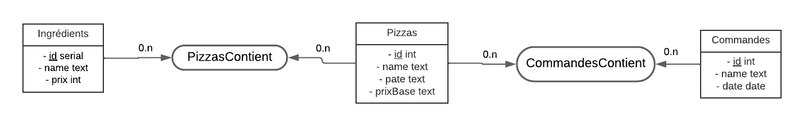

# SAE-REST_GroupeH_Belguebli_Bouin

> Auteurs: Bouin Julien, Belguebli Rayane 

## API Ingredients

|URI|Opération|MIME|Requête|Réponse
|--------|-------|-------|-------|-------|
|/ingredients|GET|<-application/json| |Liste des ingrédients (I1)|
|/ingredients/{id}|GET|<-application/json| |L'ingrédient ayant cette {id} (I1) ou 404|
|/ingredients/{id}/name|GET|<-text/plain| |Le nom de l'ingrédient ayant cette {id} ou 404|
|/ingredients|POST|<-/->application/json->application/x-www-form-urlencoded|Ingrédient (I2)|Le nouvel ingrédients (I1) ou 409 si l'ingrédient existe déjà (même nom)|
|/ingredients/{id}|DELETE|<-text/plain| |"ingredient supprimer : {nom de l'ingrédient correspondant à cette id}" ou 404|
|/ingredients/{id}|PATCH|<-application/json|Ingrédient (I2)|L'ingrédient ayant cette {id} (I1) avec le nouveau prix ou 404|

## Corps des requêtes

### I1

```json 
{
  "id": 20,
  "name": "basilic",
  "prix": 5
}
```

### I2

```json 
{"name":"poivron", "prix":"5"}
```

### I3

```json 
{"name":"poivron", "prix":"5"}
```

## Exemples

### Lister tous les ingrédients connus dans la base de données

> GET sae-rest_groupeh_belguebli_bouin/ingredients

Requête vers le serveur

```json 
GET sae-rest_groupeh_belguebli_bouin/ingredients

{
    "id": 17,
    "name": "origan",
    "prix": 2
  },
  {
    "id": 18,
    "name": "anchois",
    "prix": 4
  },
  {
    "id": 19,
    "name": "olives",
    "prix": 3
  },
  {
    "id": 20,
    "name": "basilic",
    "prix": 5
  }
```

Codes de status HTTP

|Status|Description|
|--------|-------|
|200 OK|La requête s'est effectuée correctement|

### Récupérer les détails d'un ingrédient

> GET sae-rest_groupeh_belguebli_bouin/ingredients/{id}

Requête vers le serveur

```json 
GET sae-rest_groupeh_belguebli_bouin/ingredients/17

{
    "id": 17,
    "name": "origan",
    "prix": 2
  }
```

Codes de status HTTP

|Status|Description|
|--------|-------|
|200 OK|La requête s'est effectuée correctement|
|404 NOT FOUND|L'ingrédient n'existe pas|

### Récupérer le nom d'un ingrédient

> GET sae-rest_groupeh_belguebli_bouin/ingredients/{id}/name

Requête vers le serveur

```json 
GET sae-rest_groupeh_belguebli_bouin/ingredients/17/name

"origan"
```

Codes de status HTTP

|Status|Description|
|--------|-------|
|200 OK|La requête s'est effectuée correctement|
|404 NOT FOUND|L'ingrédient n'existe pas|

### Ajouter un ingrédient

> POST sae-rest_groupeh_belguebli_bouin/ingredients

Requête vers le serveur

```json 
POST sae-rest_groupeh_belguebli_bouin/ingredients/

{"name":"poivron", "prix":"5"}
```

Réponse du serveur

```json 
{
    "id": 32,
    "name": "poivron",
    "prix": 5
  },
```

Codes de status HTTP

|Status|Description|
|--------|-------|
|200 OK|La requête s'est effectuée correctement|
|409 CONFLICT|Un ingrédient avec le même nom existe déjà|

### Supprimer un ingrédient

> DELETE sae-rest_groupeh_belguebli_bouin/ingredients/{id}

Requête vers le serveur

```json 
DELETE sae-rest_groupeh_belguebli_bouin/ingredients/17
```

Réponse du serveur

```json 
"ingredient supprimer : origan"
```

Codes de status HTTP

|Status|Description|
|--------|-------|
|200 OK|La requête s'est effectuée correctement|
|404 NOT FOUND|L'ingrédient n'existe pas|

### Changer le prix d'un ingrédient

> PATCH sae-rest_groupeh_belguebli_bouin/ingredients/{id}

Requête vers le serveur

```json 
PATCH sae-rest_groupeh_belguebli_bouin/ingredients/17
{
  "prix":"443"
}
```

Réponse du serveur

```json 
{
  "id": 13,
  "name": "lardon",
  "prix": 443
}
```


Codes de status HTTP

|Status|Description|
|--------|-------|
|200 OK|La requête s'est effectuée correctement|
|404 NOT FOUND|L'ingrédient n'existe pas|

## API PIZZA

|URI|Opération|MIME|Requête|Réponse
|--------|-------|-------|-------|-------|
|/pizzas|GET|<-application/json| |Liste des des pizzas (P1)|
|/pizzas/{id}|GET|<-application/json| |La pizza ayant cette {id} (P1) ou 404|
|/pizzas/{id}/prixfinal|GET|<-text/plain| |Le prix de la pizza ayant cette {id} ou 404|
|/pizzas|POST|<-/->application/json->application/x-www-form-urlencoded|Pizza (P2)|La nouvelle pizza (P1) ou 409 si la pizza existe déjà (même nom ou même id)|
|/pizzas/{idPizza}/{idIngredient}|POST|<-/->application/json->application/x-www-form-urlencoded||Ajoute le nouvel ingrédient {idIngredient} à la pizza {idPizza} ou 404|
|/pizzas/{id}|DELETE|<-text/plain| |"pizza supprimer : nom de la pizza correspondant à cette {id}" ou 404|
|/pizzas/{idPizza}/{idIngredient}|DELETE|<-text/plain| |"ingredient supprimer : nom de l'ingrédient correspondant à cette {idIngredient}" ou 404|
|/pizzas/{id}|PATCH|<-application/json|Pizza (P3)|La pizza ayant cette {id} (P1) avec le nouveau prixBase ou 404|

## Corps des requêtes

### P1

```json 
{
    "id": 5,
    "name": "margharita",
    "pate": "bien cuite",
    "prixBase": 5,
    "ingredients": [
      {
        "id": 21,
        "name": "jambon",
        "prix": 12
      },
      {
        "id": 22,
        "name": "champignons",
        "prix": 9
      }
    ]
  }
```

### P2

```json 
{
  "id":1,
  "name": "4 fromages",
  "pate": "bien cuite",
  "prixBase": 5,
  "ingredients": [
    { "id": 17},
    { "id": 14},
    { "id": 21},
    {"id": 22}
  ]
}
```

### P3

```json 
{
  "prix":"2"
}
```

## Exemples

### Lister tous les pizzas connus dans la base de données

> GET sae-rest_groupeh_belguebli_bouin/pizzas

Requête vers le serveur

```json 
GET sae-rest_groupeh_belguebli_bouin/pizzas

[
  {
    "id": 5,
    "name": "margharita",
    "pate": "bien cuite",
    "prixBase": 5,
    "ingredients": [
      {
        "id": 21,
        "name": "jambon",
        "prix": 12
      },
      {
        "id": 22,
        "name": "champignons",
        "prix": 9
      }
    ]
  },
  {
    "id": 2,
    "name": "4 fromages",
    "pate": "bien cuite",
    "prixBase": 2,
    "ingredients": []
  },
  {
    "id": 7888,
    "name": "margfdfharita",
    "pate": "bien cufdfdite",
    "prixBase": 5,
    "ingredients": [
      {
        "id": 21,
        "name": "jambon",
        "prix": 12
      },
      {
        "id": 22,
        "name": "champignons",
        "prix": 9
      }
    ]
  }
]
```

Codes de status HTTP

|Status|Description|
|--------|-------|
|200 OK|La requête s'est effectuée correctement|

### Récupérer les détails d'un ingrédient

> GET sae-rest_groupeh_belguebli_bouin/ingredients/{id}

Requête vers le serveur

```json 
GET sae-rest_groupeh_belguebli_bouin/pizzas/4

{
    "id": 5,
    "name": "margharita",
    "pate": "bien cuite",
    "prixBase": 5,
    "ingredients": [
      {
        "id": 21,
        "name": "jambon",
        "prix": 12
      },
      {
        "id": 22,
        "name": "champignons",
        "prix": 9
      }
    ]
  }
```

Codes de status HTTP

|Status|Description|
|--------|-------|
|200 OK|La requête s'est effectuée correctement|
|404 NOT FOUND|La pizza n'existe pas|

### Récupérer le prix d'une pizza

> GET sae-rest_groupeh_belguebli_bouin/ingredients/{id}/prixfinal

Requête vers le serveur

```json 
GET sae-rest_groupeh_belguebli_bouin/ingredients/5/prixfinal

"margharita : 26 euros"
```

Codes de status HTTP

|Status|Description|
|--------|-------|
|200 OK|La requête s'est effectuée correctement|
|404 NOT FOUND|La pizza n'existe pas|

### Ajouter une pizza

> POST sae-rest_groupeh_belguebli_bouin/pizzas

Requête vers le serveur

```json 
POST sae-rest_groupeh_belguebli_bouin/pizzas

{
  "id":5,
  "name": "margharita",
  "pate": "bien cuite",
  "prixBase": 5,
  "ingredients": [
    { "id": 21},
    { "id": 22},
  ]
}
```

Réponse du serveur

```json 
{
    "id": 5,
    "name": "margharita",
    "pate": "bien cuite",
    "prixBase": 5,
    "ingredients": [
      {
        "id": 21,
        "name": "jambon",
        "prix": 12
      },
      {
        "id": 22,
        "name": "champignons",
        "prix": 9
      }
    ]
  }
```

Codes de status HTTP

|Status|Description|
|--------|-------|
|200 OK|La requête s'est effectuée correctement|
|409 CONFLICT|Un pizza avec le même nom ou id existe déjà |

### Ajouter un ingrédient à une pizza

> POST sae-rest_groupeh_belguebli_bouin/pizzas/{idPizza}/{idIngredient}

Requête vers le serveur

```json 
POST sae-rest_groupeh_belguebli_bouin/pizzas/5/17
```

Réponse du serveur

```json 
{
    "id": 5,
    "name": "margharita",
    "pate": "bien cuite",
    "prixBase": 5,
    "ingredients": [
      {
        "id": 21,
        "name": "jambon",
        "prix": 12
      },
      {
        "id": 22,
        "name": "champignons",
        "prix": 9
      }
      {
        "id": 17,
        "name": "origan",
        "prix": 2
      }
    ]
  }
```

Codes de status HTTP

|Status|Description|
|--------|-------|
|200 OK|La requête s'est effectuée correctement|
|404 NOT FOUND|La pizza ou l'ingrédient n'existe pas|

### Supprimer une pizza

> DELETE sae-rest_groupeh_belguebli_bouin/pizzas/{id}

Requête vers le serveur

```json 
DELETE sae-rest_groupeh_belguebli_bouin/pizzas/5
```

Réponse du serveur

```json 
"pizza supprimer : margharita"
```

Codes de status HTTP

|Status|Description|
|--------|-------|
|200 OK|La requête s'est effectuée correctement|
|404 NOT FOUND|La pizza n'existe pas|

### Supprimer un ingredient d'une pizza

> DELETE sae-rest_groupeh_belguebli_bouin/pizzas/{idPizza}/{idIngredient}

Requête vers le serveur

```json 
DELETE sae-rest_groupeh_belguebli_bouin/pizzas/5/22
```

Réponse du serveur

```json 
"ingredient supprimer : champignions"
```

Codes de status HTTP

|Status|Description|
|--------|-------|
|200 OK|La requête s'est effectuée correctement|
|404 NOT FOUND|La pizza ou l'ingredient n'existe pas n'existe pas|

### Changer le prixBase d'une pizza

> PATCH sae-rest_groupeh_belguebli_bouin/pizzas/{id}

Requête vers le serveur

```json 
PATCH sae-rest_groupeh_belguebli_bouin/pizzas/5
{
  "prix":"2"
}
```

Réponse du serveur

```json 
{
  "id": 5,
  "name": "margharita",
  "pate": "bien cuite",
  "prixBase": 2,
  "ingredients": [
    {
      "id": 21,
      "name": "jambon",
      "prix": 12
    },
    {
      "id": 22,
      "name": "champignons",
      "prix": 9
    }
  ]
}
```


Codes de status HTTP

|Status|Description|
|--------|-------|
|200 OK|La requête s'est effectuée correctement|
|404 NOT FOUND|La pizza n'existe pas|

## API Commande

|URI|Opération|MIME|Requête|Réponse
|--------|-------|-------|-------|-------|
|/commandes|GET|<-application/json| |Liste des commandes (C1)|
|/commandes/{id}|GET|<-application/json| |La commande ayant cette {id} (C1) ou 404|
|/commandes/{id}/prixfinal|GET|<-text/plain| |Le prix de la commande ayant cette {id} ou 404|
|/commandes|POST|<-/->application/json->application/x-www-form-urlencoded|Commande (C2)|La nouvelle commande (c1) ou 409 si la commande existe déjà (même nom ou même id)|
|/commandes/{id}|DELETE|<-text/plain| |"commande supprimer : nom de la commande correspondant à cette {id}" ou 404|
|/commandes/{idCommande}/{idPizza}|DELETE|<-text/plain| |"pizza supprimer : nom de l'ingrédient correspondant à cette {idIngredient}" ou 404|


## Corps des requêtes

### C1

```json 
{
  "id": 1,
  "name": "cm1",
  "date": "2023-12-28",
  "list": [
    {
      "id": 2,
      "name": "4 fromages",
      "pate": "bien cuite",
      "prixBase": 2,
      "ingredients": []
    },
    {
      "id": 5,
      "name": "margharita",
      "pate": "bien cuite",
      "prixBase": 2,
      "ingredients": [
        {
          "id": 21,
          "name": "jambon",
          "prix": 12
        },
        {
          "id": 22,
          "name": "champignons",
          "prix": 9
        }
      ]
    }
  ]
}
```

### C2

```json 
{
    "id": 2,
    "name": "cm2 ",
    "date": "2004-05-45",
    "list": [
      {
        "id": 1
      },
      {
        "id": 2
      },
      {
        "id": 5
      }
    ]
}


```

## Exemples

### Lister tous les commandes connus dans la base de données

> GET sae-rest_groupeh_belguebli_bouin/commandes

Requête vers le serveur

```json 
GET sae-rest_groupeh_belguebli_bouin/commandes

[
  {
    "id": 1,
    "name": "cm1",
    "date": "2023-12-28",
    "list": [
      {
        "id": 2,
        "name": "4 fromages",
        "pate": "bien cuite",
        "prixBase": 2,
        "ingredients": []
      },
      {
        "id": 5,
        "name": "margharita",
        "pate": "bien cuite",
        "prixBase": 2,
        "ingredients": [
          {
            "id": 21,
            "name": "jambon",
            "prix": 12
          },
          {
            "id": 22,
            "name": "champignons",
            "prix": 9
          }
        ]
      }
    ]
  }
  {
    "id": 1,
    "name": "cm2",
    "date": "2024-01-28",
    "list": [
      {
        "id": 2,
        "name": "napolitaine",
        "pate": "bien cuite",
        "prixBase": 2,
        "ingredients": [
            {
                "id": 18,
                "name": "anchois",
                "prix": 4
            },
            {
                "id": 19,
                "name": "olives",
                "prix": 3
            },
            {
                "id": 20,
                "name": "basilic",
                "prix": 5
            },
            {
                "id": 21,
                "name": "jambon",
                "prix": 12
            }
        ]
      },
      {
        "id": 5,
        "name": "margharita",
        "pate": "bien cuite",
        "prixBase": 2,
        "ingredients": [
          {
            "id": 21,
            "name": "jambon",
            "prix": 12
          },
          {
            "id": 22,
            "name": "champignons",
            "prix": 9
          }
        ]
      }
    ]
  }
]
```

Codes de status HTTP

|Status|Description|
|--------|-------|
|200 OK|La requête s'est effectuée correctement|

### Récupérer les détails d'une commande

> GET sae-rest_groupeh_belguebli_bouin/ingredients/{id}

Requête vers le serveur

```json 
GET sae-rest_groupeh_belguebli_bouin/pizzas/1


  {
    "id": 1,
    "name": "cm1",
    "date": "2023-12-28",
    "list": [
      {
        "id": 2,
        "name": "4 fromages",
        "pate": "bien cuite",
        "prixBase": 2,
        "ingredients": []
      },
      {
        "id": 5,
        "name": "margharita",
        "pate": "bien cuite",
        "prixBase": 2,
        "ingredients": [
          {
            "id": 21,
            "name": "jambon",
            "prix": 12
          },
          {
            "id": 22,
            "name": "champignons",
            "prix": 9
          }
        ]
      }
    ]
  }

```

Codes de status HTTP

|Status|Description|
|--------|-------|
|200 OK|La requête s'est effectuée correctement|
|404 NOT FOUND|La commande n'existe pas|

### Récupérer le prix d'une commande

> GET sae-rest_groupeh_belguebli_bouin/commandes/{id}/prixfinal

Requête vers le serveur

```json 
GET sae-rest_groupeh_belguebli_bouin/ingredients/1/prixfinal

"cm1 : 25 euros"
```

Codes de status HTTP

|Status|Description|
|--------|-------|
|200 OK|La requête s'est effectuée correctement|
|404 NOT FOUND|La commande n'existe pas|

### Ajouter une commande

> POST sae-rest_groupeh_belguebli_bouin/commandes

Requête vers le serveur

```json 
POST sae-rest_groupeh_belguebli_bouin/commandes

{
    "id": 2,
    "name": "cm2 ",
    "date": "2004-05-45",
    "list": [
      {
        "id": 5
      }
    ]
}
```

Réponse du serveur

```json 
{
    "id": 2,
    "name": "cm2 ",
    "date": "2004-05-45",
    "list": [
      {
        "id": 5,
        "name": "margharita",
        "pate": "bien cuite",
        "prixBase": 2,
        "ingredients": [
        {
                "id": 21,
                "name": "jambon",
                "prix": 12
            },
            {
                "id": 22,
                "name": "champignons",
                "prix": 9
            }
        ]
      }
    ]
}
```

Codes de status HTTP

|Status|Description|
|--------|-------|
|200 OK|La requête s'est effectuée correctement|
|409 CONFLICT|Une commande avec le même nom ou id existe déjà existe déjà|

### Ajouter une pizza à une commande

> POST sae-rest_groupeh_belguebli_bouin/commande/{idCommande}/{idPizza}

Requête vers le serveur

```json 
POST sae-rest_groupeh_belguebli_bouin/pizzas/2/2
```

Réponse du serveur

```json 
{
    "id": 2,
    "name": "cm2 ",
    "date": "2004-05-45",
    "list": [
      {
        "id": 5,
        "name": "margharita",
        "pate": "bien cuite",
        "prixBase": 2,
        "ingredients": [
        {
            "id": 21,
            "name": "jambon",
            "prix": 12
        },
        {
            "id": 22,
            "name": "champignons",
            "prix": 9
            }
            ]
      },
      {
        "id": 2,
        "name": "4 fromages",
        "pate": "bien cuite",
        "prixBase": 2,
        "ingredients": []
      }
    ]
}
```

Codes de status HTTP

|Status|Description|
|--------|-------|
|200 OK|La requête s'est effectuée correctement|
|404 NOT FOUND|La commande ou la pizza n'existe pas|

### Supprimer une commande

> DELETE sae-rest_groupeh_belguebli_bouin/commandes/{id}

Requête vers le serveur

```json 
DELETE sae-rest_groupeh_belguebli_bouin/commandes/2

"commande supprimer : cm2 "

```

Codes de status HTTP

|Status|Description|
|--------|-------|
|200 OK|La requête s'est effectuée correctement|
|404 NOT FOUND|La commande n'existe pas|


## MCD & MLD

### MCD



## MLD

- Ingrédients(<u>id</u>, name, prix)
- Pizzas(<u>id</u>, name, pate, prixBase)
- Commandes(<u>id</u>, name, date)
- PizzasContient(<u>#idPizza, #idIngredient</u>)
- CommandesContient(<u>#idCommande, #idPizza</u>)

